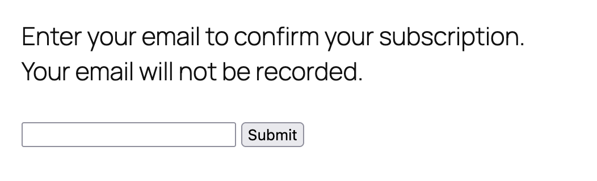

# Wordpress + Buttondown Integration Plugin (Beta)

Create subscriber-only content on your Wordpress site for your [Buttondown](https://buttondown.com) list subscribers. Use as a soft paywall to encourage both regular and paid subscriptions.

## How it works

This plugin enables shortcodes that allow content to be hidden from non-subscribers. It uses the [Buttondown API](https://docs.buttondown.com/api-introduction) to confirm if an email address is subscribed and returns a cookie indicating that the subscriber is either regular (free) or premium (paid).

## Important caveats

- This is a lightweight integration. There are no passwords involved, just a lookup to confirm an email is subscribed to your Buttondown list.
- Usage may subject your website to GDPR data protections, maybe? It's up to you to figure this out.

## Requirements

You'll need:

- A Wordpress website with permissions to upload plugins
- a [Buttondown](https://buttondown.com) account with an API token

## Installation

1. Download the latest ZIP file
2. From your WP admin dashboard, choose **Plugins > Add New Plugin**
3. Click the **Upload Plugin** button
4. Click the **Browse** button to open a file picker window
5. Select the ZIP file and upload it.
6. Click **Install Now**
7. Once installed, click **Activate Plugin**

## Settings

Before you can use the plugin, you need to configure it. Go to **Settings > WP Buttondown** to see your configuration options. All fields are required.

### Buttondown and cookie settings

* **Buttondown API Token** - The API token from your Buttondown account. You will need to activate API usage on your account.
* **Regular subscriber cookie name** - The name of the cookie used to identify a regular (free) subscriber.
* **Premium subscriber cookie name** - The name of the cookie used to identify a premium (paid) subscriber.

> ⚠️ The cookie names can be anything you want, but obvious values like "buttondown-subscriber" are not recommended because users can set these cookies themselves. Most people probably won't do this, but if you worry visitors are cheating, change the cookie names periodically.

### Landing page configuration

These are the pages that visitors will be redirected to for the login process. You must create these pages yourself. The default values are there as suggestions.

### Creating the login form

Once you've created the login page, you can place the login form on it with the `wp_buttondown_check_form` shortcode.

```
[wp_buttondown_check_form]
```

This will create the following form:



You can also place this form on any post or page that allows shortcodes.

Test your setup by submitting a valid email address that is subscribed to your Buttondown newsletter. If all is working correctly, the browser will be redirected to the "success" page specified in the plugin settings.

## Creating subscriber-only content

To create content that is only visible to subscribers, use the `wp_buttondown_regular` and `wp_buttondown_premium` shorcodes to enclose that content.

```
/* This content will only be shown to both free and paid subscribers */

[wp_buttondown_regular]
<h2>Secret Plans</h2>
<a href="/secret-plans.pdf">Download a PDF of my Secret Plans!</a>
[/wp_buttondown_regular]

/* This content will only be shown to paid subscribers */

<h2>My Grandmother's Cranberry Dandelion Tea</h2>

[wp<_buttondown_premium]
- 1/2 cup unsweetened cranderry juice
- 1-2 tea bags roasted dandelion root tea
- Lemon juice

Steep tea bags in boiling water 5-10 minutes. Allow to cool. In a pitcher, combine cranberry juice with four (4) cups cold water. Add tea and stir. Add lemon juice to taste. Serve chilled or with ice.
[/wp_buttondown_premium]

```

## Troubleshooting

### Blank page instead of redirect after login
Check that your landing pages actually exist and that there are no typos.
